# <p align="center">Universidad de las Fuerzas Armadas - ESPE</p>

### Desarrollo Web para Intregación de Tecnologías

**Nombres:**
- Fonseca Rafael
- Rodriguez Danny
- Tamayo Pablo

**NRC:** 10047


## Desarrollo de una API REST para Gestión de Tareas

### Configuración Inicial:
Se creo un nuevo proyecto Spring Boot utilizando Spring Initializr con las dependencias necesarias para crear una aplicación web y acceder a una base de datos.

**Dependecias usadas:**
- Spring Web
- Spring Data JPA
- PostgreSQL Driver

[Link](https://start.spring.io/#!type=maven-project&language=java&platformVersion=3.1.2&packaging=jar&jvmVersion=20&groupId=web&artifactId=AplicacionCRUD&name=AplicacionCRUD&description=Aplicacion%20CRUD&packageName=web.AplicacionCRUD&dependencies=web,data-jpa,postgresql) de la aplicación base

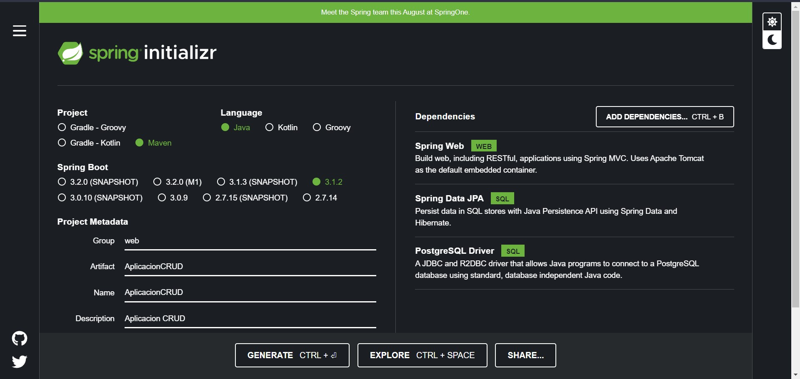

#### Creación de la Base de Datos con Docker Compose
Primero desarrollamos nuestro archivo docker-compose.yaml
<pre>
<code>
version: '3'
services:
  javaCRUD:
    image: postgres
    container_name: web
    ports:
      - "5432:5432"
    environment:
      POSTGRES_PASSWORD: "admin"
    volumes:
    - ./DB/postgres:/var/lib/postgresql/data
    cpus: 0.5
    mem_limit: 512m
</code>
</pre>
Recuerda reemplazar el contenido del ejemplo con tu propio código real. Este formato garantiza que el código se muestre con formato de monoespacio y resaltado de sintaxis adecuado en el archivo Markdown.


#### Configuración del archivo application.properties
Se configuro el archivo application.properties con los siguientes datos:
```properties
# Puerto del servidor web
server.port=8080

# Configuración de la fuente de datos (Base de Datos PostgreSQL)
spring.datasource.url = jdbc:postgresql://localhost:5432/DBTasks
spring.datasource.username = postgres
spring.datasource.password = admin

# Configuración de Hibernate (ORM)
spring.jpa.hibernate.ddl-auto = create-drop
spring.jpa.show-sql = true

# Configuración específica de Hibernate para PostgreSQL
spring.jpa.properties.hibernate.dialect = org.hibernate.dialect.PostgreSQLDialect
spring.jpa.properties.hibernate.format_sql = true
```

### Modelo de Datos
Se creo una base de datos en PostreSQL llamada **DBTasks** con una tabla "task_palication" que tiene tiene los siguientes campos: id, date, description, name, status
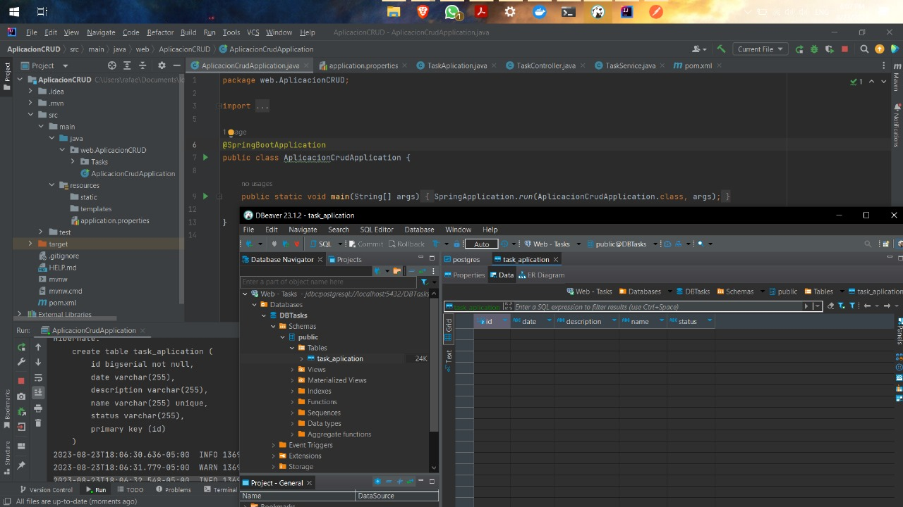


### Repositorio de Tareas TaskRepository.java

``` java
// TaskRepository.java
package web.AplicacionCRUD.Tasks;

import org.springframework.data.jpa.repository.JpaRepository;
import org.springframework.stereotype.Repository;

import java.util.Optional;

// La anotación @Repository indica que esta interfaz es un componente de repositorio de Spring
@Repository
// La interfaz TaskRepository extiende JpaRepository, lo que proporciona funcionalidad de repositorio para la entidad TaskAplication con ID de tipo Long
public interface TaskRepository extends JpaRepository<TaskAplication, Long> {

	// Este método define una consulta personalizada para buscar una tarea por su nombre
	Optional<TaskAplication> findTaskAplicationByName(String name);
}
```

### Controlador de Tareas TaskController.java
```java
// TaskController.java

package web.AplicacionCRUD.Tasks;

import org.springframework.beans.factory.annotation.Autowired;
import org.springframework.http.ResponseEntity;
import org.springframework.stereotype.Service;
import org.springframework.web.bind.annotation.*;

import java.util.List;

// La anotación @RestController indica que esta clase es un controlador de Spring que manejará las solicitudes HTTP
@RestController
// La anotación @RequestMapping establece la ruta base para todas las solicitudes manejadas por este controlador
@RequestMapping(path = "api/tasks")
// La anotación @Service indica que esta clase es un componente de servicio de Spring
@Service
public class TaskController {

	// Se inyecta el servicio TaskService en el controlador utilizando la anotación @Autowired
	private final TaskService taskService;

	@Autowired
	public TaskController(TaskService taskService) {
    	this.taskService = taskService;
	}

	// El método HTTP GET mapeado a la ruta base devuelve una lista de tareas
	@GetMapping
	public List<TaskAplication> getAllTask() {
    	return taskService.getTasks();
	}

	// El método HTTP POST mapeado a la ruta base crea una nueva tarea a partir de los datos en el cuerpo de la solicitud
	@PostMapping
	public ResponseEntity<Object> crearTask(@RequestBody TaskAplication task) {
    	// Se llama al método createTask del servicio para crear la tarea
    	return taskService.createTask(task);
	}

	// El método HTTP PUT mapeado a la ruta base actualiza una tarea existente a partir de los datos en el cuerpo de la solicitud
	@PutMapping
	public ResponseEntity<Object> actualizarTask(@RequestBody TaskAplication task) {
    	// Se llama al método updateTask del servicio para actualizar la tarea
    	return taskService.updateTask(task);
	}

	// El método HTTP DELETE mapeado a la ruta base elimina una tarea según su ID
	@DeleteMapping(path = "{taskId}")
	public ResponseEntity<Object> eliminarTask(@PathVariable("taskId") Long taskId) {
    	// Se llama al método deleteTask del servicio para eliminar la tarea
    	return taskService.deleteTask(taskId);
	}
}

```

### Servicio de Tareas TaskService.java
```java
// TaskService.java

package web.AplicacionCRUD.Tasks;

import org.springframework.beans.factory.annotation.Autowired;
import org.springframework.http.HttpStatus;
import org.springframework.http.ResponseEntity;
import org.springframework.web.bind.annotation.GetMapping;
import org.springframework.web.bind.annotation.RequestMapping;
import org.springframework.web.bind.annotation.RestController;
import org.springframework.stereotype.Service;
import java.net.http.HttpResponse;
import java.util.HashMap;
import java.util.List;
import java.util.Optional;

@Service
public class TaskService {
	// Repositorio de tareas, inyectado automáticamente por Spring
	private static TaskRepository taskRepository = null;

	// Constructor de TaskService, se utiliza para inyectar TaskRepository
	@Autowired
	public TaskService(TaskRepository taskRepository) {
    	this.taskRepository = taskRepository;
	}

	// Método para obtener todas las tareas
	public List<TaskAplication> getTasks() {
    	return this.taskRepository.findAll();
	}

	// Método para crear una nueva tarea
	public ResponseEntity<Object> createTask(TaskAplication task) {
    	Optional<TaskAplication> existingTask = taskRepository.findTaskAplicationByName(task.getName());
    	HashMap<String, Object> datos = new HashMap<>();

    	if (existingTask.isPresent()) {
        	// Si la tarea ya existe, se devuelve una respuesta de conflicto
        	datos.put("data", false);
        	datos.put("message", "La Tarea ya existe");
        	return new ResponseEntity<>(datos, HttpStatus.CONFLICT);
    	} else {
        	// Si la tarea no existe, se guarda en la base de datos y se devuelve una respuesta de creación
        	TaskAplication savedTask = taskRepository.save(task);
        	datos.put("data", savedTask);
        	datos.put("message", "Tarea creada");

        	return new ResponseEntity<>(datos, HttpStatus.CREATED);
    	}
	}

	// Método para actualizar una tarea existente
	public static ResponseEntity<Object> updateTask(TaskAplication task) {
    	Optional<TaskAplication> existingTask = taskRepository.findById(task.getId());
    	HashMap<String, Object> datos = new HashMap<>();

    	if (existingTask.isPresent()) {
        	// Si la tarea existe, se actualiza en la base de datos y se devuelve una respuesta OK
        	TaskAplication savedTask = taskRepository.save(task);
        	datos.put("data", savedTask);
        	datos.put("message", "Tarea actualizada");

        	return new ResponseEntity<>(datos, HttpStatus.OK);
    	} else {
        	// Si la tarea no existe, se devuelve una respuesta NOT_FOUND
        	datos.put("data", false);
        	datos.put("message", "La tarea con ID " + task.getId() + " no existe");
        	return new ResponseEntity<>(datos, HttpStatus.NOT_FOUND);
    	}
	}

	// Método para eliminar una tarea existente
	public static ResponseEntity<Object> deleteTask(Long taskId) {
    	boolean exists = taskRepository.existsById(taskId);
    	HashMap<String, Object> datos = new HashMap<>();

    	if (!exists) {
        	// Si la tarea no existe, se devuelve una respuesta NOT_FOUND
        	datos.put("data", false);
        	datos.put("message", "La tarea con ID " + taskId + " no existe");
        	return new ResponseEntity<>(datos, HttpStatus.NOT_FOUND);
    	}

    	// Si la tarea existe, se elimina de la base de datos y se devuelve una respuesta OK
    	taskRepository.deleteById(taskId);
    	datos.put("data", true);
    	datos.put("message", "La tarea con ID " + taskId + " ha sido eliminada");
    	return new ResponseEntity<>(datos, HttpStatus.OK);
	}
}

```


### Ejecución y pruebas

Las pruebas se realizaron con **Postman** con el siguiente URL: http://localhost:8080/api/tasks

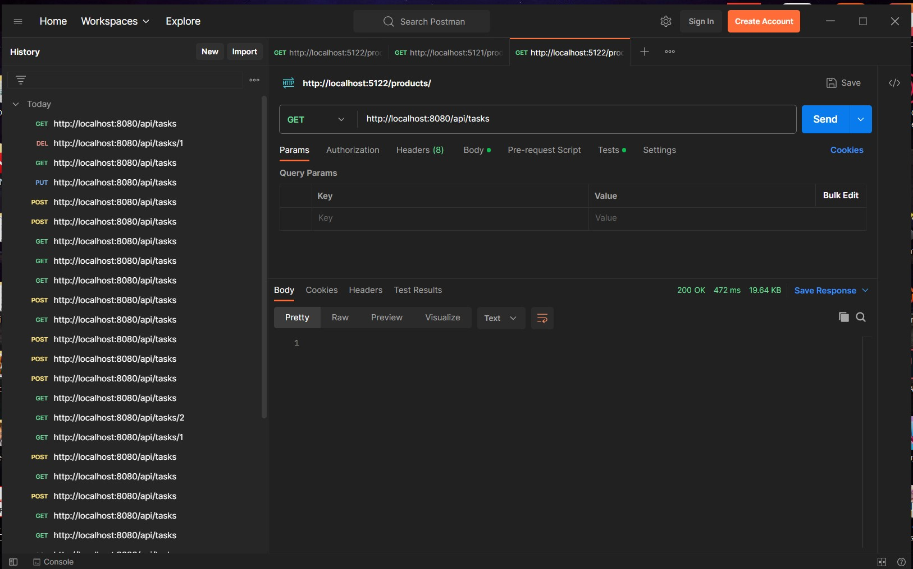

#### GET
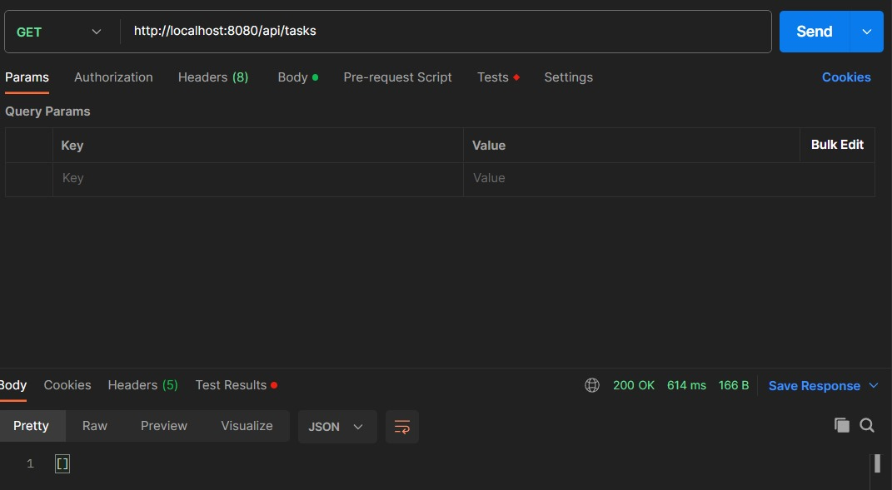

### POST
Se incerto el siguiente JSON y nos aparece que se creo correctamente la tarea:
```json
{
  "name":"Web 3",
  "description":"Realizar el deber",
  "date":"21-08-2023",
  "status":"Finalizado"
}
```
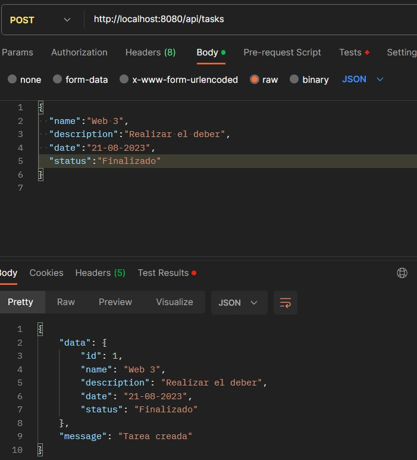

Creamos otra tarea:
```json
{
  "name":"IA",
  "description":"Realizar Automata Finito",
  "date":"21-08-2023",
  "status":"En proceso"
}
```
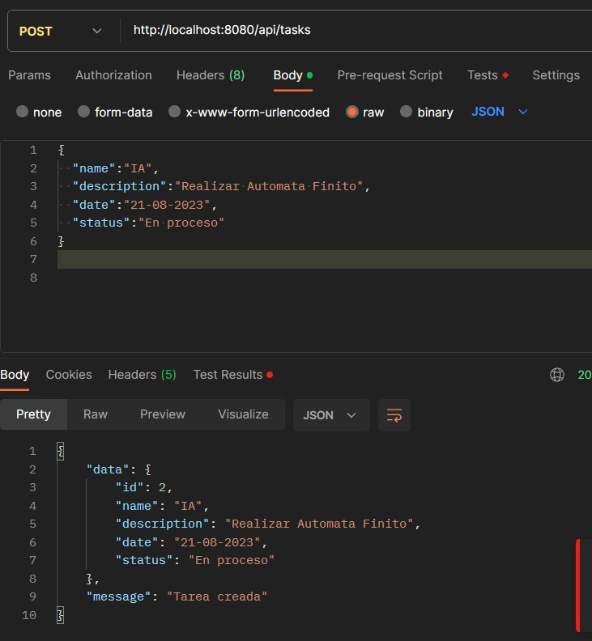


### PUT
Se actualizo la tarea con el id 1 con el siguiente JSON:
```json
{
  "name":"Web 3",
  "description":"Modificado",
  "date":"21-08-2023",
  "status":"En proceso"
}
```
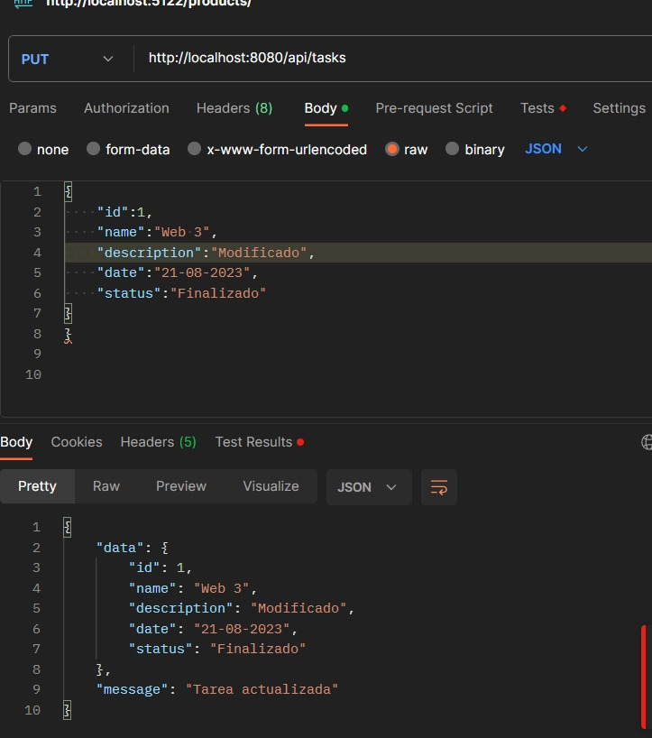

Verficamos con un GET y nos aparece que se modifico correctamente:
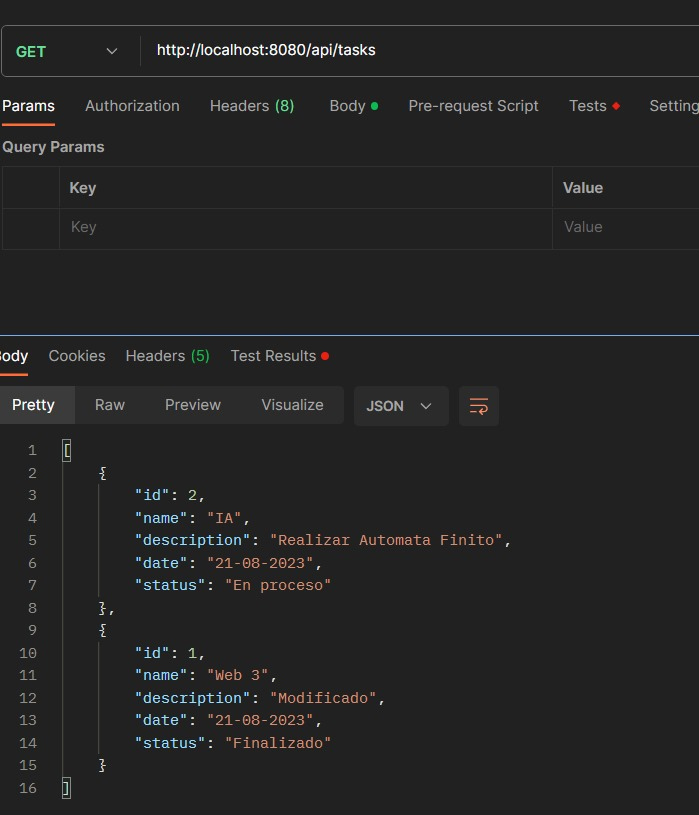

### DELETE
Se elimino la tarea con el id 1 con el siguiente url: http://localhost:8080/api/tasks/1
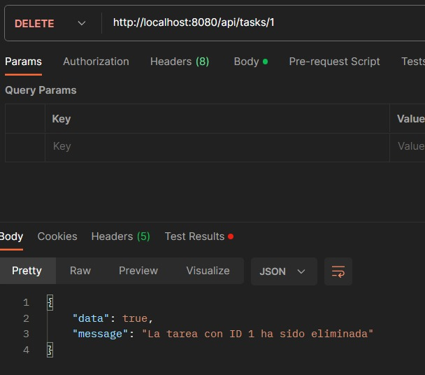

Si hacemos un GET nos aparece que no existe la tarea con el id 1:
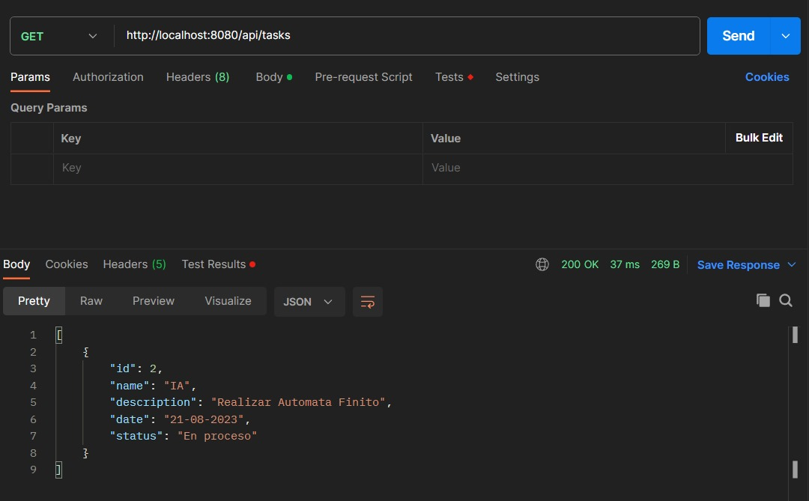

### Base de Datos Final
Si revisamos la base de datos nos aparece que solo existe la tarea con el id 2:
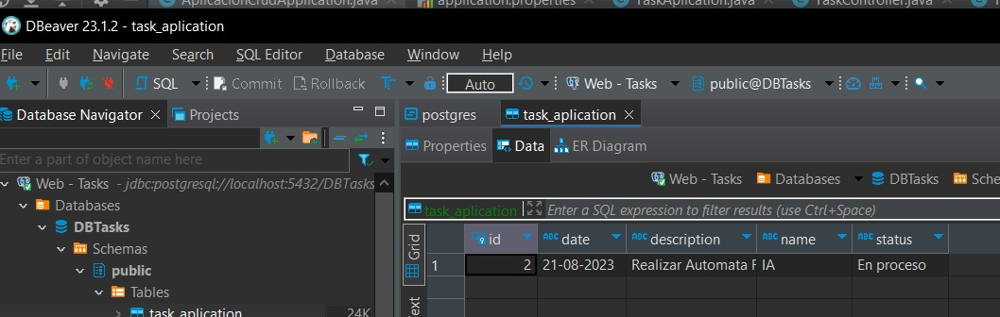


